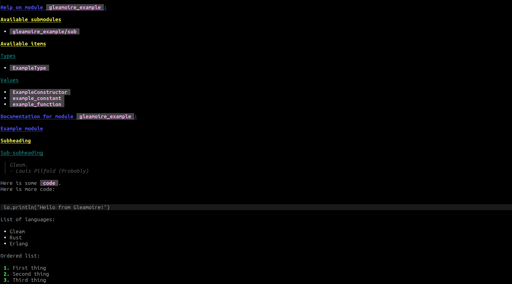

# Gleamoire

Gleamoire is a tool for documenting Gleam modules in the command line, inspired by `pydoc`.

## Easy to use
Gleamoire is very easy to quickly look something up. Simply run `gleamoire gleam/int` to try it out.

## Easy to read
Gleamoire renders markdown documentation in the terminal, which makes reading documentation much easier than raw markdown code.



## Easy to install
If you have erlang installed, it's as simple as downloading the `escript` binary, and putting it somewhere in your path.

## Usage
Run `gleamoire --help` to see a full usage guide.

### Viewing documentation
To use Gleamoire to view documentation for a module, function or type, simply run:
```sh
gleamoire <query>
```

For example:
```sh
gleamoire gleam/io.println
```
Would document the `println` function of the `gleam/io` package.

Sometimes there are a type and value with the same name, for example:
```gleam
// mod.gleam
pub type Thing {
  Thing
  OtherThing
}
```
Here, `mod.Thing` can refer to the type `Thing`, or the value `Thing`.

To fix this ambiguity, use the `-v` flag to print the value, or the `-t` flag for the type:
```sh
gleamoire mod.Thing -v # Documents the `Thing` value
gleamoire mod.Thing -t # Documents the `Thing` type
```

### Queries
Gleamoire finds documentation based on a query passed to the CLI. The syntax of the query is:
```
[package:]root/sub1/sub2[.item]
```

By default, the query looks for a package with the same name as the root module, since that is the most common pattern in Gleam. However, if the two differ, an explicit package can be specified.
> [!NOTE]
> A special case is made for official packages (`gleam_*`), community packages (`gleam_community_*`), and the standard library, which don't follow
> this convention, and are likely to be documented commonly.

## Contributing
Contributions to Gleamoire are welcome!
To get started:

```sh
# Clone the repository
git clone https://github.com/GearsDatapacks/gleamoire
cd gleamoire
# Verify all tests are passing
gleam test
# Run the CLI
gleam run
```

To build a Gleamoire escript binary to run a development version:
```sh
gleam run -m gleescript
```
